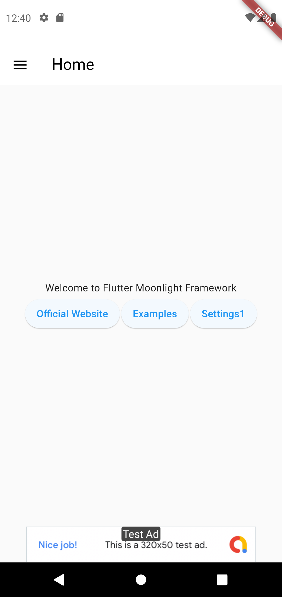

# Flutter MoonLight

This Docs given Flutter easy implement Flutter Project

### 💰 Support by donating or sponsoring us.,
 
 [](https://github.com/sponsors/bhargavraviya) [](https://www.patreon.com/raviyatechnical/membership) [](https://www.buymeacoffee.com/raviyatechnical) [](https://ko-fi.com/raviyatechnical)
-----

## Screenshots



## Features

- Core Routes
- BloC Architecture (Clean Architecture)
- MVC Architecture 
- HTTP CRUD Method (MVC Architecture )
- SQLite CRUD Method (MVC Architecture )
- Local Notification
- Local Database using sqflite package
- Switch To Dark or Light Mode
- Banner Ad - Google Mobile Ads (Google Admob)
- Firebase Remote Config
- Provider 
- Permission Handler

## Laravel REST API package recommendation

[https://github.com/raviyatechnical/laravel-api-generator](https://github.com/raviyatechnical/laravel-api-generator)


## MoonLight Examples

- Load More Data Using API With Caching API
- Local Database - CRUD Operation
- Local Notification

## Examples Bloc
- CRUD App (Clean Architecture)

## Examples MVC

- CRUD Controller App (HTTP CRUD Method)
- Sql CRUD Controller App (CRUD Method)
- Counter App
- Load More Data Using API MVC

## Examples

- Grid Layout
- Load local image
- Load local json
- Load More Data Using API## Documentation
- Using Bottom Navigation Bar
- Dynamic Tab View using json 
- Using Alert Dialog
- Using Snack Bar
- Data Table
- Paginated Data Table
- Autocomplete
- Check Internet Connection
- Youtube Video Player
- Firebase Remote Config
- Count Provider (provider package)
- Permission Handler (permission_handler package)
  
## Reusable Widgets

- Drawer With DrawerTile
- Navbar
- Full Screen Loader
- No Data Found
- On Screen Loader For Full Screen
- No More Content For Load More Content
- showMessage For Snack Bar
- Banner Ad Widget From Google Admob Ads
- Banner Ad Widget From Google Admob Ads Using Firebase Remote Config 
- Permission Handler Widget Dialog For Permission Handler Package

<!-- ## Documentation

[Documentation](https://rajtechnologiespvtltd.github.io/flutter-moonlight/docs) -->

## Run Locally

Clone the project

```bash
git clone https://github.com/RajTechnologiesPvtLtd/flutter-moonlight moonlight
```

Go to the project directory

```bash
cd moonlight
```

Install dependencies

```bash
flutter pub get
```

Setup Localizations

```bash
flutter gen-l10n
```

Start the server

```bash
flutter run
```

## Deployment For Android

To deploy this project run

```bash
  flutter build apk --release
```

## add local.properties

```bash
flutter.minSdkVersion=23
flutter.targetSdkVersion=28
flutter.compileSdkVersion=35
```

## Tech Stack

**Client:** Flutter (No Framework)

**Server:** NONE

**Local Databases:** Sqflite

## Authors

- [Bhargav Raviya](https://www.github.com/bhargavraviya)

## License

[MIT](https://github.com/RajTechnologiesPvtLtd/flutter-moonlight/blob/master/LICENSE)

##  Google Mobile Ads

https://github.com/firebase/quickstart-android/blob/master/mock-google-services.json